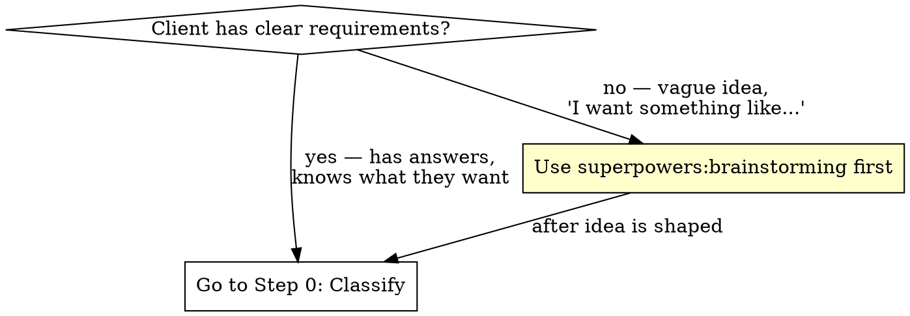

# Project Discovery to Spec

## Overview

Systematic methodology for transforming raw client input into implementation-ready documentation. **Scales to project complexity** — from a 1-page ambulance site to a complex multi-role platform.

**Core principle:** No code until the analysis matches the project's complexity. Every ambiguity = tracked open question. Every assumption = documented decision.

**Supporting files (read when needed):**
- `coding-standards.md` — Laravel architecture rules, security, CORS, rate limiting, file uploads, sessions, error handling, logging, deployment, testing. Also works as a standalone skill. Use when writing Phase 5 coding standards deliverable.
- `edge-cases.md` — Type-specific edge case checklists. Use when writing Phase 3.

## Required Superpowers Skills

**You MUST use these skills at the appropriate phase.** This is not optional — each skill enforces discipline that prevents costly mistakes.

### Full Project Lifecycle

```
┌─────────────────────────────────────────────────────────────┐
│  DISCOVERY & PLANNING                                       │
│                                                             │
│  1. superpowers:brainstorming (if vague idea)               │
│     ↓                                                       │
│  2. new-laravel-project — Phases 1-7                        │
│     ↓                                                       │
│  3. Client approves spec                                    │
│     ↓                                                       │
│  4. superpowers:writing-plans → implementation plan          │
│                                                             │
├─────────────────────────────────────────────────────────────┤
│  IMPLEMENTATION (per task from plan)                         │
│                                                             │
│  5. superpowers:using-git-worktrees → isolate feature        │
│     ↓                                                       │
│  6. superpowers:test-driven-development → write test FIRST   │
│     ↓                                                       │
│  7. Implement code to pass test                              │
│     ↓                                                       │
│  8. superpowers:systematic-debugging (if test fails)         │
│     ↓                                                       │
│  9. superpowers:verification-before-completion → verify done │
│     ↓                                                       │
│  10. superpowers:requesting-code-review → review the work    │
│     ↓                                                       │
│  11. superpowers:receiving-code-review (if feedback comes)   │
│     ↓                                                       │
│  12. superpowers:finishing-a-development-branch → merge/PR   │
│                                                             │
│  Parallelization (when plan has independent tasks):         │
│  • superpowers:subagent-driven-development                  │
│  • superpowers:dispatching-parallel-agents                  │
│                                                             │
├─────────────────────────────────────────────────────────────┤
│  REPEAT steps 5-12 for each task in the plan                │
└─────────────────────────────────────────────────────────────┘
```

### Quick Reference

| # | Skill | Trigger |
|---|-------|---------|
| 1 | **superpowers:brainstorming** | Client can't describe features → shape idea first |
| 2 | **new-laravel-project** | Requirements exist → run Phases 1-7 discovery |
| 3 | **superpowers:writing-plans** | Spec approved → create implementation plan |
| 4 | **superpowers:using-git-worktrees** | Starting a task → isolate in worktree |
| 5 | **superpowers:test-driven-development** | Before ANY code → write test first |
| 6 | **superpowers:systematic-debugging** | Bug or test failure → diagnose root cause |
| 7 | **superpowers:verification-before-completion** | About to claim "done" → run checks, show evidence |
| 8 | **superpowers:requesting-code-review** | Task complete → review against requirements |
| 9 | **superpowers:receiving-code-review** | Got feedback → evaluate technically, don't blindly agree |
| 10 | **superpowers:finishing-a-development-branch** | All tests pass → merge, PR, or cleanup |
| 11 | **superpowers:subagent-driven-development** | Plan has independent tasks → parallelize via subagents |
| 12 | **superpowers:dispatching-parallel-agents** | 2+ tasks, no shared state → run simultaneously |

## Before You Start: Brainstorming Gate



**When to brainstorm first:** Client says "I want an app for X" but can't describe features, users, or scope. Use `superpowers:brainstorming` to shape the idea, THEN come here for structured analysis.

**When to go straight to discovery:** Client has answers (questionnaire filled, feature list written, existing similar product to replicate). Start at Step 0.

---

## Step 0: Classify the Project

Determine the project type. This controls which domains you ask about and how deep you go.

### Tier 1: Presentation (simple)

Static or near-static sites with minimal interactivity.

| Type | Examples |
|------|----------|
| **Single-page / Landing** | Product launch page, event page, coming soon |
| **Brochure / Company** | Ambulance, law firm, restaurant, gym, construction company |
| **Portfolio** | Photographer, designer, artist, agency showcase |
| **Blog / Magazine** | Personal blog, news site, content-driven site |

**Signals:** No user accounts (or just admin), no complex data, no payments, content is the product.
**Scope:** 15-30 questions, 5-10 UCs, 3-5 deliverables, 1-2 hours analysis.

### Tier 2: Application (medium)

Dynamic applications with user accounts, data management, and/or transactions.

| Type | Examples | Key Complexity |
|------|----------|---------------|
| **E-shop** | Clothing store, electronics, food delivery, digital products | Cart, checkout, inventory, shipping, payments, orders |
| **Booking / Reservation** | Doctor, salon, hotel, restaurant, car rental, coworking, fitness | Calendar, availability, time slots, capacity, no-shows, reminders |
| **Directory / Listing** | Real estate portal, job board, business directory, event listings | Listing lifecycle, claimed/unclaimed, map, featured/promoted |
| **LMS / E-learning** | Online courses, training, school portal, certification platform | Courses/lessons, progress, certificates, quizzes, video hosting |
| **Portal / Intranet** | Client portal, employee intranet, community, members area | Access control, documents, internal communication, dashboards |

**Signals:** User accounts, CRUD operations, some role differentiation, may have payments.
**Scope:** 40-60 questions, 15-30 UCs, 15-25 ECs, 7-9 deliverables, 3-5 hours analysis.

### Tier 3: Platform (complex)

Multi-role systems with complex business logic, workflows, and integrations.

| Type | Examples | Key Complexity |
|------|----------|---------------|
| **Marketplace** | Service marketplace, freelancer platform, rental marketplace, multi-vendor store | Two-sided (vendor+buyer), commission, trust/reviews, payouts, disputes |
| **SaaS** | Project management, CRM, invoicing, analytics tool, HR system | Multi-tenancy, subscription billing, onboarding, API, data isolation |
| **Multi-role Platform** | Casting agency, healthcare system, logistics platform, government portal | 4+ roles, approval workflows, complex permissions, audit trails |

**Signals:** Multiple distinct user roles (4+), complex workflows, multi-sided business model, subscription/commission payments.
**Scope:** 80-100 questions, 40-60 UCs, 30-50 ECs, 11-13 deliverables, 6-10 hours analysis.

### Deliverables by Tier

| # | Deliverable | Tier 1 | Tier 2 | Tier 3 |
|---|-------------|:---:|:---:|:---:|
| 1 | Discovery questionnaire | Yes (short) | Yes | Yes (full) |
| 2 | Use cases | Minimal | Yes | Yes + cross-cutting |
| 3 | Edge cases | Skip or minimal | Yes | Yes (thorough) |
| 4 | Open questions | Inline in other docs | Yes | Yes (standalone) |
| 5 | Tech recommendations | Brief | Yes | Yes (detailed) |
| 6 | Notification catalog | Skip | If has emails | Yes |
| 7 | Design requirements | Brand checklist only | Yes | Yes |
| 8 | Time estimation | Simple total | By module | By module + OQ impact |
| 9 | Maintenance plan | Skip | Brief | Yes |
| 10 | Coding standards | Skip (use defaults) | Brief | Yes |
| 11 | Client: project description | Optional | Yes | Yes |
| 12 | Client: time estimate | Combined with above | Yes | Yes |
| 13 | Final review | Skip | Quick pass | Full audit |

---

## Phase 1: Discovery Questionnaire

Questions grouped by domain. **Pick only domains relevant to your project type.**

### Domain Map: Which Domains for Which Type

| Domain | T1 Presentation | T2 E-shop | T2 Booking | T2 Directory | T2 LMS | T2 Portal | T3 Marketplace | T3 SaaS | T3 Platform |
|--------|:---:|:---:|:---:|:---:|:---:|:---:|:---:|:---:|:---:|
| D1 Business Goals | Yes | Yes | Yes | Yes | Yes | Yes | Yes | Yes | Yes |
| D2 Site Map | Yes | Yes | Yes | Yes | Yes | Yes | Yes | Yes | Yes |
| D3 Core Data Model | — | Yes | Yes | Yes | Yes | Yes | Yes | Yes | Yes |
| D4 Entity Fields | — | Yes | Yes | Yes | Yes | — | Yes | Yes | Yes |
| D5 Search & Filtering | — | Yes | Light | Yes | Light | — | Yes | Light | Yes |
| D6 Media & Files | Yes | Yes | Light | Yes | Yes | Yes | Yes | Light | Yes |
| D7 E-commerce | — | **Core** | — | — | — | — | Adapted | — | — |
| D8 User-Facing Tools | — | Yes | Yes | Yes | Yes | Yes | Yes | Yes | Yes |
| D9 User Accounts & Roles | Light | Yes | Yes | Yes | Yes | Yes | Yes | Yes | Yes |
| D10 Admin & Workflows | — | Yes | Yes | Yes | Yes | Yes | Yes | Yes | Yes |
| D11 Payments & Pricing | — | **Core** | Yes | Optional | Optional | — | **Core** | **Core** | If applicable |
| D12 Design & Branding | Yes | Yes | Yes | Yes | Yes | Yes | Yes | Yes | Yes |
| D13 GDPR & Security | Light | Yes | Yes | Yes | Yes | Yes | Yes | Yes | Yes |
| D14 SEO & Analytics | Light | Yes | Yes | Yes | Yes | — | Yes | Light | Yes |
| D15 Shipping & Logistics | — | **Core** | — | — | — | — | If physical | — | — |
| D16 Infrastructure | Light | Yes | Yes | Yes | Yes | Yes | Yes | Yes | Yes |
| D17 Operations & Handover | — | Yes | Yes | Yes | Yes | Yes | Yes | Yes | Yes |
| D18 Integrations & APIs | — | Yes | Yes | Optional | Optional | Yes | Yes | Yes | Yes |
| D19 Localization | — | If multi-lang | If multi-lang | If multi-lang | If multi-lang | — | Yes | Yes | If multi-lang |
| D20 Onboarding & Empty States | — | — | — | — | Yes | Yes | Yes | **Core** | Yes |
| D21 Communication & Messaging | — | — | Yes | Optional | Yes | Yes | Yes | Optional | Yes |
| D22 Reporting & Dashboards | — | Yes | Yes | Optional | Yes | Yes | Yes | Yes | Yes |
| D23 Migration & Launch | — | If migrating | If migrating | If migrating | If migrating | If migrating | If migrating | If migrating | If migrating |
| D24 Booking & Scheduling | — | — | **Core** | — | — | — | — | — | — |
| D25 Marketplace Dynamics | — | — | — | — | — | — | **Core** | — | — |
| D26 Directory & Listings | — | — | — | **Core** | — | — | — | — | — |
| D27 LMS & Learning | — | — | — | — | **Core** | — | — | — | — |
| D28 SaaS & Multi-tenancy | — | — | — | — | — | — | — | **Core** | — |
| D29 Portal & Internal Tools | — | — | — | — | — | **Core** | — | — | — |

**Bold = core domain for that type. Light = ask 2-3 basic questions only.**

---

### Universal Domains (all/most types)

#### D1: Business Goals & Scope
**Use:** ALL

| Tier | Questions |
|------|-----------|
| **All** | Main goal? MVP definition? Target market? Languages? Deadline? Decision maker? Budget range? |
| **T2-T3** | Phase 1 vs Phase 2 split? What can wait? Competitor analysis? Revenue model? |

#### D2: Site Map & Content
**Use:** ALL

| Tier | Questions |
|------|-----------|
| **T1** | How many pages? Sections per page? Static content? Who provides texts/photos? |
| **T2-T3** | Must-have pages? Static vs dynamic? Blog/news? Admin-editable sections? SEO landing pages? |

#### D3: Core Data Model
**Use:** T2, T3

| Type | Questions |
|------|-----------|
| **E-shop** | Product structure? Categories/subcategories? Variants (size/color)? SKU? Inventory? Statuses? |
| **Booking** | Bookable resources (rooms/slots/people)? Availability model? Duration types? |
| **Directory** | Listing structure? Categories? Listing statuses? Claimed vs unclaimed? |
| **LMS** | Course > module > lesson hierarchy? Quiz/assignment types? Certificate rules? |
| **Marketplace** | Vendor entity? Product/service entity? Order entity? Relationship between vendor and platform? |
| **SaaS** | Tenant entity? Core data objects? Relationships? How data is isolated between tenants? |
| **Platform** | All entities? Categories? Statuses? Relationships? Public vs internal? Approval workflows? |

#### D4: Entity Fields & Configuration
**Use:** T2, T3

| Type | Questions |
|------|-----------|
| **E-shop** | Product fields? Price structure (base/sale/bulk)? Tax categories? Custom attributes? |
| **Booking** | Resource fields? Booking fields (date, time, duration, party size)? Customer info collected? |
| **Directory** | Listing fields? Contact info? Opening hours? Amenities/features? Verification fields? |
| **LMS** | Course fields? Lesson content types? Quiz question types? Student profile fields? |
| **SaaS/Platform** | Mandatory vs optional? Lookup tables (admin-managed enums)? Registration flow? Multi-step? |

#### D5: Search, Filtering & Navigation
**Use:** T2, T3 (T1 only if portfolio/gallery)

| Type | Questions |
|------|-----------|
| **E-shop** | Category navigation? Price range? Attribute filters? Sort options? Autocomplete? |
| **Directory** | Location/map search? Category browse? Radius search? "Near me"? Sort by rating/distance? |
| **Marketplace** | Search scope (vendors, products, services)? Filter by vendor rating? Price range? Category tree? |
| **Platform** | Filter types? AND/OR logic? Fulltext scope? Autocomplete? Saved filters? Real-time counter? |

#### D6: Media & Files
**Use:** ALL (scaled)

| Tier | Questions |
|------|-----------|
| **T1** | Who provides photos? Format? Gallery? Video embeds? |
| **T2** | Photos per entity? Zoom? Gallery? Video? Upload limits? Optimization? User-uploaded vs admin? |
| **T3** | Supported types? Limits per entity? Upload pipeline? Storage (S3)? CDN? Playback? Watermarks? |

#### D7: E-commerce
**Use:** E-shop, Marketplace (adapted)

| Questions |
|-----------|
| Product catalog structure? Categories, tags, brands? |
| Price model: fixed, variable, bulk discounts, sales/promotions? |
| Cart: guest cart? persistence? abandoned cart emails? |
| Checkout: steps? guest checkout? address validation? |
| Shipping: methods? zones? weight-based? flat rate? free threshold? carrier API? |
| Inventory: track stock? backorder? low-stock alerts? multi-warehouse? |
| Returns/refunds: policy? RMA process? automated or manual? |
| Reviews/ratings? Moderation? |
| Wishlists / compare? |
| Recommended/related products: manual or algorithmic? |
| Order statuses and lifecycle? |
| Invoicing: auto-generate? PDF? Legal requirements (local/EU)? |

#### D8: User-Facing Tools
**Use:** T2, T3

| Type | Questions |
|------|-----------|
| **E-shop** | Wishlist? Compare? Order tracking? Returns portal? Account features? |
| **Booking** | Booking history? Rebooking? Cancellation self-service? Favourite providers? Calendar sync? |
| **Directory** | Save/favourite listings? Contact form per listing? Claim listing? Leave review? |
| **LMS** | Course library? Progress dashboard? Certificate download? Note-taking? Discussion forum? |
| **Marketplace** | Vendor dashboard? Buyer order history? Messaging between parties? Dispute filing? |
| **SaaS** | Settings panel? Team management? Data export? API keys? Usage dashboard? |
| **Portal** | Document library? Request forms? Status tracking? Announcements? Profile management? |

#### D9: User Accounts & Roles
**Use:** ALL (scaled)

| Tier | Questions |
|------|-----------|
| **T1** | Contact form only? Admin for content? |
| **T2** | How many roles? Registration types? Social login? Email verification? |
| **T3** | All role definitions + permissions? Registration per role? Verification? 2FA? Impersonation? |

#### D10: Admin & Workflows
**Use:** T2, T3

| Type | Questions |
|------|-----------|
| **E-shop** | Order management? Inventory? Product CRUD? Customer management? Discounts/coupons? |
| **Booking** | Schedule management? Booking approval (auto/manual)? Resource management? Blackout dates? |
| **Directory** | Listing moderation? Claim approval? Featured listing management? Category management? |
| **LMS** | Course creation workflow? Student enrollment? Grade management? Certificate issuance? |
| **Marketplace** | Vendor approval? Commission management? Dispute resolution? Payout management? |
| **SaaS** | Tenant management? Plan management? Feature flags? Usage monitoring? Support tickets? |
| **Platform** | Approval workflows? Status lifecycle? Audit trail? Internal notes? Bulk operations? |

#### D11: Payments & Pricing
**Use:** T2 (if applicable), T3

| Type | Questions |
|------|-----------|
| **E-shop** | Payment methods (card, transfer, COD, Apple/Google Pay)? Gateway? Invoicing? VAT? Currency? |
| **Booking** | Deposit or full payment? Pay online or on-site? No-show fee? Cancellation refund policy? |
| **Directory** | Free listings? Promoted/featured = paid? Subscription for premium listing? |
| **LMS** | Free courses? Paid courses (one-time)? Subscription model? Bundle pricing? Instructor payouts? |
| **Marketplace** | Commission model (% or flat)? Who pays (buyer/seller/split)? Payout schedule? Escrow? Stripe Connect? |
| **SaaS** | Plan tiers? Free tier/trial? Per-seat or flat? Usage-based? Annual discount? Upgrade/downgrade flow? |

#### D12: Design & Branding
**Use:** ALL

| Tier | Questions |
|------|-----------|
| **T1** | Logo? Colors? Fonts? Reference sites? Mobile-first? Template or custom? Who provides content? |
| **T2-T3** | Brand assets status? Template vs custom? Visual direction? References? Mobile priority? Accessibility? |

#### D13: GDPR & Security
**Use:** ALL (scaled)

| Tier | Questions |
|------|-----------|
| **T1** | Contact form? Cookie consent? Analytics? Privacy policy text? |
| **T2** | Sensitive data inventory? Consents needed? Cookie policy? Data retention? Account deletion? |
| **T3** | Full: sensitive data, consents, encryption, minor workflow, right to be forgotten, audit logging, DPO? |

#### D14: SEO & Analytics
**Use:** ALL (scaled)

| Tier | Questions |
|------|-----------|
| **T1** | SEO basics: title, description, OG image? Google Analytics? Google Business Profile? |
| **T2** | Entity SEO (products/listings/courses)? Category pages? Blog? Schema.org? GA4? Conversions? |
| **T3** | Priority pages? Indexing rules? Schema.org types? GTM data layer? Conversion events? Meta Pixel? |

#### D15: Shipping & Logistics
**Use:** E-shop, Marketplace (if physical goods)

| Questions |
|-----------|
| Shipping providers? API integrations (local carriers, international carriers)? |
| Pickup points? Parcel lockers? |
| Shipping calculation: weight? dimensions? zone-based? |
| Free shipping threshold? |
| International shipping? EU? Customs? |
| Package tracking? Delivery time estimates? |

#### D16: Infrastructure & Performance
**Use:** T2, T3 (T1: just hosting)

| Tier | Questions |
|------|-----------|
| **T1** | Where to host? Domain ready? SSL? |
| **T2-T3** | Expected traffic? Concurrent users? Data growth? Performance targets? Environments? CI/CD? Backups? Monitoring? **Domain structure:** single domain, subdomains (admin.app.com, api.app.com), multiple domains, locale domains (app.sk, app.cz)? Custom domains per tenant? |

#### D17: Operations & Handover
**Use:** T2, T3

| Questions |
|-----------|
| Who manages hosting/DNS/SSL after launch? Maintenance plan? Documentation? Training? Pricing model (fixed/hourly/retainer)? |

---

### New Universal Domains

#### D18: Integrations & APIs
**Use:** T2, T3 (when connecting to external systems)

| Type | Questions |
|------|-----------|
| **E-shop** | Accounting software? ERP? Product feed (Google Shopping, price comparison sites)? Carrier APIs? |
| **Booking** | Calendar sync (Google Calendar, iCal, Outlook)? SMS provider? Online meeting (Zoom, Google Meet)? |
| **Directory** | Map provider (Google Maps, Mapbox, OpenStreetMap)? Social media import? Data enrichment API? |
| **LMS** | Video hosting (Vimeo, Wistia)? Zoom/Teams for live classes? Certificate generation API? SCORM? |
| **Marketplace** | Payment split (Stripe Connect)? Shipping aggregator? Communication API (Twilio)? |
| **SaaS** | What APIs does YOUR product expose? Webhook support? Zapier/Make integration? OAuth provider? |
| **Portal** | Active Directory / LDAP? SSO (SAML/OIDC)? Existing CRM/ERP? Document management system? |
| **All** | Email service (Resend, Postmark, Mailgun)? Analytics? Social login providers? AI/ML services? |

#### D19: Localization & Internationalization
**Use:** Any multi-language or multi-market project

| Questions |
|-----------|
| Languages at launch vs later? |
| Currency: single or multi? Display vs charge currency? Rounding rules? |
| Date/time format per locale? Timezone handling for scheduled content? |
| Phone number format? International prefix? |
| Address format per country (SK vs CZ vs DE)? |
| Translation workflow: who translates? Professional or machine? |
| RTL language support planned? |
| Legal differences per market (VAT, consumer protection, GDPR variations)? |

#### D20: Onboarding & Empty States
**Use:** T2-T3 apps with user accounts, especially SaaS

| Questions |
|-----------|
| What does a brand-new user see after registration? Empty dashboard? |
| Onboarding wizard or guided tour? How many steps? |
| Sample/demo data to show features? |
| First-action prompt ("Create your first X")? |
| Progress indicator (profile completeness, setup checklist)? |
| Email onboarding drip sequence (day 1, 3, 7)? |
| What does an empty search result look like? Empty list? |
| Admin: what does the system look like before any data exists? |

#### D21: Communication & Messaging
**Use:** T2-T3 where users need to communicate through the platform

| Questions |
|-----------|
| Internal messaging between users? (buyer-seller, client-provider, student-teacher) |
| Real-time chat or async messages? |
| Notifications for new messages (email, push, in-app)? |
| File attachments in messages? |
| Message moderation or flagging? |
| Comments / discussion threads on entities (products, listings, courses, posts)? |
| Admin broadcast announcements? |
| Contact forms per entity (listing, profile) vs centralized contact? |

#### D22: Reporting & Dashboards
**Use:** T2-T3

| Type | Questions |
|------|-----------|
| **E-shop** | Sales reports? Revenue by period/category/product? Customer acquisition? Inventory reports? |
| **Booking** | Occupancy rate? Revenue per resource? Peak hours? No-show rate? |
| **Directory** | Listing stats (views, clicks, contacts)? Category popularity? Owner dashboard? |
| **LMS** | Student progress reports? Course completion rates? Quiz scores? Instructor earnings? |
| **Marketplace** | GMV? Commission earned? Vendor performance? Buyer retention? |
| **SaaS** | MRR/ARR? Churn rate? Feature usage? Trial-to-paid conversion? Per-tenant usage? |
| **Platform** | Registration stats? Demographic reports? Usage patterns? Entity popularity? |
| **Admin (all)** | What KPIs does the client want to see? Exportable? Real-time or periodic? |

#### D23: Migration & Launch
**Use:** Any project replacing an existing system

| Questions |
|-----------|
| Existing site/system? URL? |
| Data to migrate? Format (spreadsheet, database, API, manual)? Volume? |
| URL redirect map needed (old URLs → new URLs)? How many? |
| SEO preservation: existing rankings to protect? |
| Email migration (existing newsletters, subscriber lists)? |
| Go-live strategy: big bang or gradual rollout? |
| DNS cutover plan? TTL preparation? |
| Rollback plan if launch fails? |
| Downtime acceptable during migration? |
| Training needed before go-live? |

---

### Type-Specific Domains

#### D24: Booking & Scheduling
**Use:** Booking/Reservation systems

| Questions |
|-----------|
| What is being booked? (time slots, rooms, tables, vehicles, people, services) |
| Booking model: fixed slots (e.g., every 30min) or flexible duration? |
| Availability: set by admin? by provider? Calendar-based? |
| Capacity per slot: 1 person or multiple? (1:1 vs group booking) |
| Buffer time between bookings? Setup/cleanup time? |
| Booking horizon: how far in advance? Minimum notice? |
| Recurring bookings? (weekly appointment, monthly) |
| Multi-resource booking? (room + equipment + instructor) |
| Cancellation policy: free until X hours before? Fee? No-show handling? |
| Waitlist when fully booked? |
| Confirmation: automatic or manual approval by provider? |
| Reminders: email/SMS before appointment? How many? When? |
| Calendar integration: sync to Google Calendar / iCal / Outlook? |
| Timezone handling: provider vs customer timezone? |
| Walk-in support alongside online booking? |
| Seasonal availability? Holidays? Blackout dates? |
| Staff/provider assignment: manual or automatic? |
| Group booking with individual attendee tracking? |

#### D25: Marketplace Dynamics
**Use:** Two-sided marketplaces

| Questions |
|-----------|
| **Sides:** Who are the two (or more) sides? (vendor/buyer, provider/customer, host/guest) |
| **Onboarding:** How does a vendor join? Application + approval? Self-serve? Invitation? |
| **Listings:** Who creates listings — vendor only or platform also? Listing approval needed? |
| **Commission:** Percentage or flat fee? Per transaction? Monthly fee? Tiered? Who pays — buyer, vendor, or split? |
| **Payouts:** How are vendors paid? Frequency (instant, weekly, monthly)? Minimum payout? |
| **Payment split:** Stripe Connect? PayPal for Marketplaces? Manual? |
| **Trust:** Reviews and ratings — one-way or mutual? Verified badges? Identity verification? |
| **Disputes:** Dispute/claim resolution process? Refund policy? Escrow? |
| **Search:** Unified search across vendors? How to rank results fairly? Promoted/boosted listings? |
| **Communication:** Buyer-vendor messaging? Through platform or direct? |
| **Vendor tools:** Vendor dashboard? Inventory management? Analytics? Payout history? |
| **Platform take:** What value does the platform add beyond matching? (insurance, payment guarantee, logistics, marketing) |
| **Chicken-and-egg:** Launch strategy — which side to attract first? Initial content/supply? |

#### D26: Directory & Listings
**Use:** Directory, listing, and classified sites

| Questions |
|-----------|
| **Listing types:** What is being listed? (businesses, properties, jobs, events, services, products) |
| **Lifecycle:** User-submitted → moderated → published? Or admin-only creation? |
| **Ownership:** Can listing owners claim and manage their listing? Verification process? |
| **Profile richness:** What info per listing? (description, photos, hours, contact, amenities, map) |
| **Categories:** Flat or hierarchical? Multi-category per listing? |
| **Location:** Map view? Radius search? "Near me" (geolocation)? Region/city filter? |
| **Reviews:** User reviews per listing? Star ratings? Moderation? Owner response? |
| **Featured/Promoted:** Paid featured placement? How long? Pricing? |
| **Comparison:** Compare listings side-by-side? |
| **Contact:** Contact form per listing? Click-to-call? Track contact requests? |
| **Freshness:** Expiry date on listings? Renewal reminders? Auto-archive stale listings? |
| **Import:** Bulk import from CSV/external source? API feed? |
| **SEO:** Each listing = indexable page? Schema.org type (LocalBusiness, JobPosting, Event, RealEstateListing)? |

#### D27: LMS & Learning
**Use:** E-learning and training platforms

| Questions |
|-----------|
| **Content hierarchy:** Course > Section > Lesson? Or flat? |
| **Content types:** Video, text, PDF, slides, interactive? SCORM/xAPI support? |
| **Video hosting:** Self-hosted? YouTube/Vimeo private? Streaming service (Mux, Bunny)? |
| **Progress tracking:** Per-lesson completion? Resume where left off? Progress percentage? |
| **Quizzes/Assessments:** Question types (multiple choice, free text, matching, code)? Passing score? Retakes? |
| **Assignments:** File upload submissions? Instructor grading? Peer review? |
| **Certificates:** Auto-generated on completion? PDF template? Verifiable URL? Expiry? |
| **Enrollment:** Open enrollment? Cohort-based? Invitation-only? Prerequisites? |
| **Instructor role:** Can instructors create courses? Revenue share? Instructor dashboard? |
| **Live sessions:** Scheduled live classes? Zoom/Teams integration? Recording? |
| **Discussion:** Forum per course? Comments per lesson? Q&A? |
| **Gamification:** Points, badges, leaderboards? Streak tracking? |
| **Drip content:** Release lessons on schedule (week 1, week 2)? |
| **Mobile:** Offline access? Mobile app or responsive web? |
| **Reporting:** Student progress reports? Course completion stats? Instructor analytics? |

#### D28: SaaS & Multi-tenancy
**Use:** Software-as-a-Service products

| Questions |
|-----------|
| **Tenancy model:** Shared database with tenant_id? Separate DB per tenant? Hybrid? |
| **Isolation:** How strictly isolated is tenant data? Can admins see across tenants? |
| **Plans & limits:** What differentiates plans? Feature flags? Usage limits (users, storage, API calls)? |
| **Trial:** Free trial? Duration? Credit card required? What happens at trial end? |
| **Onboarding:** Tenant setup wizard? Sample data? Guided tour? |
| **Team management:** Invite users to tenant? Roles within tenant (owner, admin, member)? |
| **Branding:** White-label per tenant? Custom domain? Custom logo/colors? |
| **API:** Public API for tenants? Rate limiting? API key management? Webhooks? |
| **Data export:** Can tenants export their data? Format? GDPR data portability? |
| **Billing:** Per-seat, flat, usage-based, or hybrid? Overage charges? |
| **Upgrade/downgrade:** Immediate or end-of-period? Prorated? Feature access change? |
| **Admin panel:** Platform admin (you) vs tenant admin (customer) — separate panels? |
| **Monitoring:** Per-tenant usage dashboards? Health metrics? Error tracking per tenant? |
| **Scaling:** Expected number of tenants? Data volume per tenant? Horizontal scaling needed? |

#### D29: Portal & Internal Tools
**Use:** Client portals, employee intranets, community platforms

| Questions |
|-----------|
| **Purpose:** Client-facing portal? Employee intranet? Member community? Partner extranet? |
| **Authentication:** Internal SSO (Active Directory, SAML, OIDC)? External login? Invitation-only? |
| **Content:** Announcements/news? Knowledge base? FAQ? Wiki? |
| **Documents:** Document library? Upload/download? Version control? Access restrictions per folder? |
| **Requests/Tickets:** Can users submit requests? Ticket tracking? Status updates? |
| **Directory:** People directory? Search by department/skill/location? Org chart? |
| **Forms:** Custom forms for data collection? Workflow triggers on submission? |
| **Calendar:** Shared events? Room booking? Holiday calendar? |
| **Dashboards:** Role-based dashboards? KPI widgets? Personalized content? |
| **Notifications:** How are users notified of new content? Email digest? In-app? |
| **Mobile:** Mobile access required? App or responsive web? |
| **Permissions:** Role-based or group-based content access? Department-level isolation? |

---

### Questionnaire Rules (all tiers)

- Questions must be **specific and concrete** with examples
- Accept answers in client's native language
- Number every question (Q1-Q...) for cross-referencing
- Mark unclear answers for follow-up (become open questions)
- For T1: questionnaire can be a single document, not separate file

---

## Phase 2: Use Cases

### Structure

```
### UC-{ACTOR}{NUMBER}: {Title}
**Trigger:** What starts this flow
**Flow:**
1. Step-by-step (numbered, include branches)
2. Reference questionnaire answers (Q14, Q56)
**Post:** End state.
```

### Actor Groups by Project Type

| T1 Presentation | T2 E-shop | T2 Booking | T2 Directory | T2 LMS | T2 Portal | T3 Marketplace | T3 SaaS | T3 Platform |
|---|---|---|---|---|---|---|---|---|
| Visitor | Customer | Customer | Visitor | Student | Member | Buyer | Tenant user | Per role |
| Admin (if CMS) | Guest shopper | Provider/Staff | Listing owner | Instructor | Admin | Vendor/Seller | Tenant admin | External users |
| — | Admin | Admin | Admin/Moderator | Admin | — | Platform admin | Platform admin | Internal roles |
| — | System | System | System | System | System | System | System | System |

### Cross-Cutting Sections

Include based on project needs:

| Section | When to include |
|---------|----------------|
| **Site map / IA** | Always (all tiers) |
| **Field visibility matrix** | Multiple roles see different data |
| **Category/type matrix** | Entities have types with different rules |
| **Role permission matrix** | 3+ roles |
| **Export templates** | PDF/Excel/invoice generation |
| **Media limits per tier** | Subscription tiers with different limits |
| **Registration field requirements** | Multi-step registration |
| **Order/booking status lifecycle** | E-shop, booking, marketplace |
| **Commission/payout rules** | Marketplace |
| **Notification trigger map** | 10+ notification types |

---

## Phase 3: Edge Cases

**T1:** Skip or note 3-5 obvious ones.
**T2-T3:** Systematic module scan. **See `edge-cases.md` for complete type-specific checklists.**

---

## Phase 4: Open Questions

Same structure for all tiers. Scale the effort:

- **T1:** 3-5 OQs, inline in other docs
- **T2:** 10-20 OQs, separate document
- **T3:** 15-30 OQs, separate doc with priority classification

### Structure

```
## OQ-{NUMBER}: {Title}
**Source:** Q{number}
**Status:** OPEN | DECIDED (temporary) | CLOSED
**Question:** The specific decision needed
**Options:** A) ... B) ... C) ...
**Recommendation:** Your pick with reasoning
**Impact:** What this affects
**Action:** Who decides
```

### Priority Classification (T2-T3)

| Priority | Criteria |
|----------|----------|
| **Blocking** | Cannot start dev without this |
| **Important for early dev** | Affects data model or core architecture |
| **Can wait** | Affects later modules or Phase 2 |

---

## Phase 5: Technical Deliverables

### Tech Recommendations

**T1:** Brief — hosting, CMS/framework choice, domain, SSL.

**T2:**

| Type | Key Decisions |
|------|---------------|
| **E-shop** | Platform (custom vs Shopify/WooCommerce/Sylius), payment gateway, shipping integration, invoice/accounting |
| **Booking** | Framework, calendar library, SMS provider, payment gateway, calendar sync approach |
| **Directory** | Framework, map provider + pricing, search engine (PostgreSQL vs Algolia/Meilisearch), geocoding |
| **LMS** | Framework, video hosting solution, quiz engine, certificate generation, SCORM support |
| **Portal** | Framework, SSO/LDAP integration, document storage, real-time notifications |

**T3:**

| Type | Key Decisions |
|------|---------------|
| **Marketplace** | Framework, Stripe Connect vs alternatives, escrow approach, search, commission engine |
| **SaaS** | Framework, tenancy approach (package choice), billing (Stripe/Paddle), API framework, feature flag system |
| **Platform** | Full: framework, DB, packages, admin panel, infra, deployment, email, analytics, SEO, monthly costs |

### Platform Infrastructure

**Always include in tech recommendations (T2-T3).** This is the production environment.

| Area | What to decide |
|------|----------------|
| **Hosting** | Self-managed VPS vs managed PaaS vs cloud provider |
| **Web server** | Server software, reverse proxy, process management |
| **Database** | Engine, version, managed vs self-hosted, backup strategy. **Deliberate choice** — evaluate data shape, query needs, scale. Document WHY. |
| **Cache & queue** | Cache backend, session storage, async job processing |
| **File storage** | Object storage + CDN for media-heavy apps |
| **Email** | Transactional email service + marketing/bulk if needed |
| **SSL** | Certificate strategy (auto-renew, wildcard, per-domain) |
| **Monitoring** | Error tracking, uptime monitoring, centralized logs |
| **Backups** | Automated DB backups, media backup, **tested** restore procedure |
| **Environments** | Production, staging (production mirror), local dev |

### Development Infrastructure

**Always include (T2-T3).** This is what the dev team works with daily.

| Area | What to decide |
|------|----------------|
| **Local environment** | Containerized (Docker) vs native. Must match production closely. |
| **CI/CD** | Automated pipeline: lint → analyze → test → deploy. Every PR. |
| **Version control** | Branching strategy. Branch protection. PR reviews. |
| **Code quality** | Static analysis + linting + formatting — enforced in CI, not optional |
| **Testing** | Unit, feature/integration, browser/E2E — enforced in CI |
| **Pre-commit hooks** | Run formatter + static analysis before commit. Catches issues before CI. |
| **Deployment** | Zero-downtime strategy. Rollback plan. Automated checklist (build, migrate, cache, restart workers, health check). |

### Coding Standards

**T3 (or T2 if custom-built).** Must include: architecture rules, security headers, CORS policy, error handling, logging, deployment checklist, testing rules, code formatting.

**See `coding-standards.md` for the complete universal checklist** — all decisions to make, with rationale.

### Notification Catalog

**T1:** Skip.
**T2:** Event-driven emails for the core flow (orders/bookings/listings/enrollments + account lifecycle).
**T3:** Every system event: recipient, channel, template, timing.

### Other Deliverables

- **Design Requirements** — All tiers: brand assets checklist. T2-T3: page-by-page complexity, accessibility, content delivery.
- **Time Estimation** — All tiers. T1: simple total. T2-T3: by module, optimistic/realistic, dependencies, OQ impact.
- **Maintenance Plan** — T2-T3. Post-launch support, ongoing tasks, handover, data retention.

---

## Phase 6: Client-Facing Documents

**T1:** Optional.
**T2-T3:** Separate documents in client's language:

1. **Project Description** — What we build, who uses it, complexity explained, features, open questions, phases
2. **Time Estimate** — Module breakdown, timeline, NOT included list, next steps

**Rule:** Client docs explain WHAT and WHY, never HOW.

---

## Phase 7: Final Review

**T1:** Skip.
**T2:** Quick pass — questionnaire answers mapped, no contradictions.
**T3:** Full audit:
1. Cross-reference check (every Q answer maps to UC or OQ)
2. Blind spot analysis (what's NOT documented?)
3. OQ cleanup (merge duplicates, classify priorities)
4. Consistency check (numbers, statuses, field names match across docs)

---

## After Phase 7: Transition to Implementation

**Discovery is complete. Next steps — in order:**

1. **Client reviews & approves spec** — wait for sign-off before proceeding
2. **Invoke `superpowers:writing-plans`** — creates detailed implementation plan from the approved spec
3. **Invoke `superpowers:using-git-worktrees`** — isolate implementation work
4. **For each task: `superpowers:test-driven-development`** — write test first, then implement
5. **After each task: `superpowers:verification-before-completion`** → `superpowers:requesting-code-review`** → `superpowers:finishing-a-development-branch`**

**Do NOT skip any step. Do NOT write code without a plan. Do NOT write code without a test.**

---

## Quick Start Recipes

### T1: Presentation / Ambulance / Portfolio

1. Ask 15-25 questions: D1, D2, D6, D12, D13 (light), D14 (light)
2. Write 5-10 use cases: visitor flows + admin (if CMS)
3. Note 3-5 edge cases inline
4. Brief tech recommendation
5. Brand asset checklist + simple time estimate
6. Done.

### T2: E-shop

1. Ask 40-60 questions: D1-D2, D3-D4 (products), D5 (search), D6, **D7 (e-commerce core)**, D8, D9-D10, **D11 (payments)**, D12-D14, **D15 (shipping)**, D16-D17, D18 (integrations), D22 (reports), D23 (if migrating)
2. 15-30 UCs by actor + site map + order status lifecycle
3. 15-25 ECs (cart, checkout, inventory, shipping, returns)
4. 10-20 OQs. **Key decision: custom build vs SaaS platform**
5. Tech stack (platform comparison critical), notification catalog
6. Design + time estimate + client docs
7. Quick review

### T2: Booking / Reservation

1. Ask 35-50 questions: D1-D2, D3-D4 (resources), D6 (light), D8, D9-D10, D11 (if online payment), D12-D14, D16-D17, D18 (calendar sync, SMS), **D21 (reminders)**, D22, **D24 (booking core)**
2. 15-25 UCs: customer booking flow, provider management, admin, system (reminders, no-shows)
3. 15-20 ECs (double booking, no-shows, cancellation, timezone, buffer)
4. 10-15 OQs. **Key decision: approval model (auto vs manual)**
5. Tech + notifications (reminders are critical)
6. Design + time estimate + client docs

### T2: Directory / Listing

1. Ask 35-50 questions: D1-D2, D3-D4 (listings), **D5 (search/map)**, D6, D8, D9-D10, D11 (if promoted listings), D12-D14 (SEO critical), D16-D17, D18 (maps), **D26 (directory core)**
2. 15-25 UCs: visitor, listing owner, admin/moderator, system
3. 15-20 ECs (duplicates, stale data, fake reviews, claims, map)
4. 10-15 OQs. **Key decision: user-submitted vs admin-curated**
5. Tech (map provider + pricing is key decision)
6. Design + time estimate + client docs

### T2: LMS / E-learning

1. Ask 40-55 questions: D1-D2, D3-D4 (courses), D5 (light), **D6 (video hosting critical)**, D8, D9-D10, D11 (if paid courses), D12-D13, D14, D16-D17, D18 (video, Zoom), **D21 (discussion)**, D22, **D27 (LMS core)**
2. 15-30 UCs: student, instructor, admin, system (progress, certificates)
3. 15-20 ECs (video loading, quiz edge cases, certificate fraud, progress calc)
4. 10-15 OQs. **Key decision: self-paced vs cohort-based**
5. Tech (video hosting is biggest cost/architecture decision)
6. Design + time estimate + client docs

### T2: Portal / Intranet

1. Ask 30-45 questions: D1-D2, D6 (documents), D8, **D9 (auth critical)**, D10, D12, D13, D16-D17, **D18 (SSO/LDAP)**, **D20 (onboarding)**, D21, D22, **D29 (portal core)**
2. 10-20 UCs: member/employee, admin, system
3. 10-15 ECs (permissions, SSO, documents, offline)
4. 5-10 OQs. **Key decision: SSO integration method**
5. Tech (auth/SSO is key architectural decision)
6. Design + time estimate

### T3: Marketplace

1. Full 70-90 questions: D1-D6, **D7 (adapted)**, D8-D14, D15 (if physical), D16-D18, D19, **D20 (vendor onboarding)**, **D21 (buyer-vendor messaging)**, **D22**, D23, **D25 (marketplace core)**
2. 35-50 UCs + cross-cutting (commission rules, payout schedule, trust, dispute resolution)
3. 25-40 ECs (disputes, payouts, vendor disappearance, multi-vendor orders)
4. 15-25 OQs. **Key decision: commission model + payment split approach**
5. All deliverables. Stripe Connect setup is key tech decision.
6. Client docs + full review

### T3: SaaS

1. Full 70-90 questions: D1-D4, D5 (light), D6 (light), D8-D10, **D11 (billing core)**, D12-D14 (light), D16-D18, **D19**, **D20 (onboarding critical)**, D21 (optional), **D22 (analytics)**, D23, **D28 (SaaS core)**
2. 35-50 UCs + cross-cutting (plan limits matrix, feature flag matrix, tenant isolation rules)
3. 25-40 ECs (tenant isolation, plan limits, downgrade, trial expiry, API rate limits)
4. 15-25 OQs. **Key decision: tenancy model + billing approach**
5. All deliverables. Multi-tenancy architecture is #1 tech decision.
6. Client docs + full review

### T3: Complex Multi-Role Platform

1. Full 80-100 questions across all relevant domains
2. 40-60 UCs + all cross-cutting sections (matrices, sitemap, exports)
3. 30-50 ECs with systematic module scan
4. 15-30 OQs with priority classification
5. All deliverables (tech, notifications, design, time, maintenance, coding standards)
6. Client docs + full review audit

---

## Common Mistakes

| Mistake | Fix |
|---------|-----|
| Using T3 process for a T1 project | Classify first. 100 questions for a single-page site wastes everyone's time |
| Using T1 process for a T3 project | Underdoing analysis = scope explosion mid-development |
| Skipping brainstorming for vague ideas | If client can't describe features, brainstorm first, then discover |
| E-shop without shipping domain (D15) | Shipping is 30% of e-shop complexity. Always ask. |
| Booking without double-booking edge cases | Concurrency is THE core booking problem. Always address. |
| Marketplace without commission model questions | This is the business model. Can't build without it. |
| SaaS without tenancy model decision | This is the #1 architectural decision. Affects everything. |
| LMS without video hosting strategy | Video is 80% of LMS cost/infra. Decide early. |
| Directory without map provider comparison | Map API pricing can blow the budget. Compare before committing. |
| No integration domain questions | Almost every T2-T3 connects to something. Ask D18 always. |
| Skipping onboarding/empty states | First-time user experience is often designed last and it shows |
| No migration plan when replacing existing site | Lost SEO, broken links, missing data. Ask D23. |
| Skipping cross-cutting sections (T3) | Field visibility and permission matrices catch 30%+ of complexity |
| No open question tracking | "We'll figure it out later" = scope creep |
| Technical docs shown to non-technical client | Always create separate summaries in their language |
| Missing "NOT included" in time estimate | Client must know their responsibilities (content, legal, photos) |
| No platform infrastructure section | Hosting, CDN, monitoring, backups must be decided before code. Not "later". |
| No dev infrastructure defined | CI/CD, linting, testing pipeline — set up day 1, not month 3. |
| No coding standards deliverable | See `coding-standards.md` — architecture, security, testing rules must be defined before code. |
